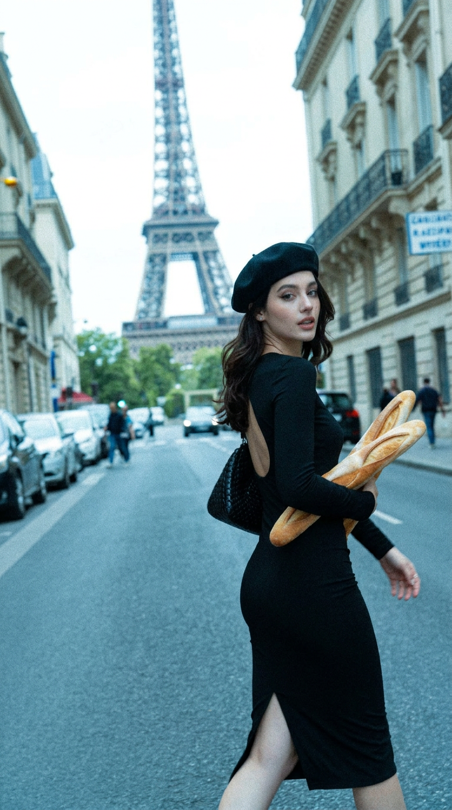
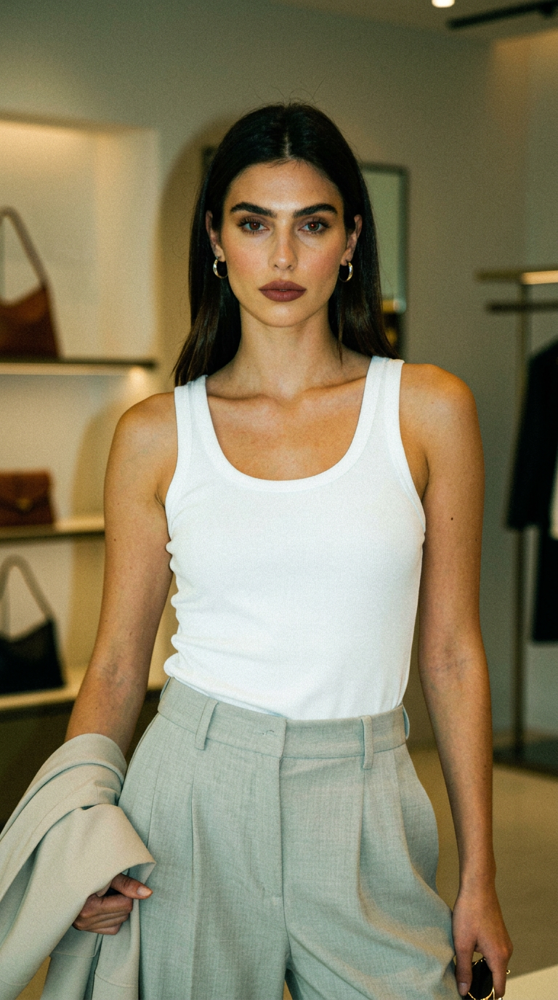
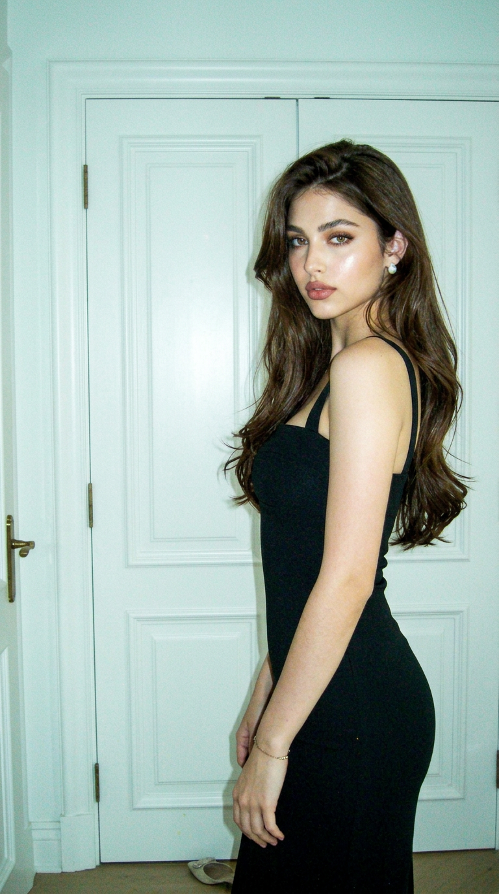
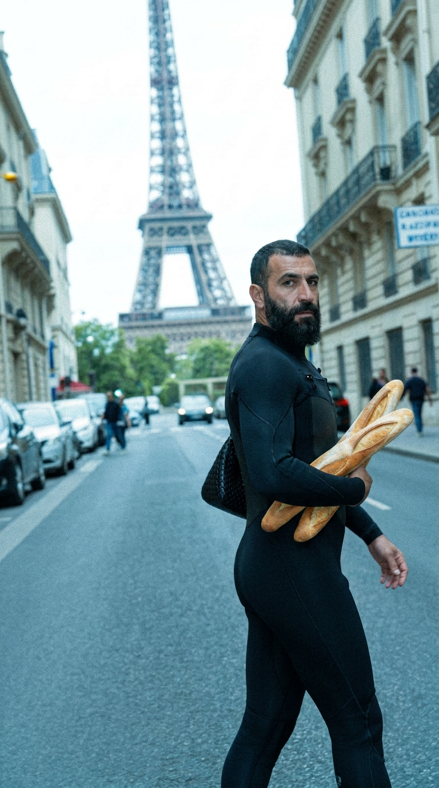
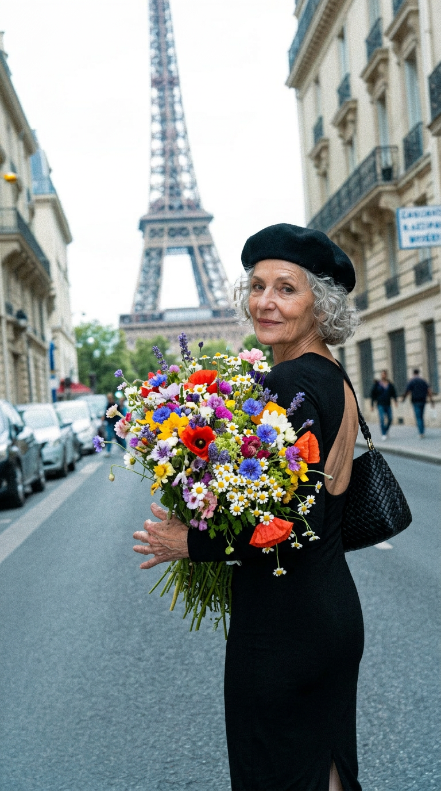
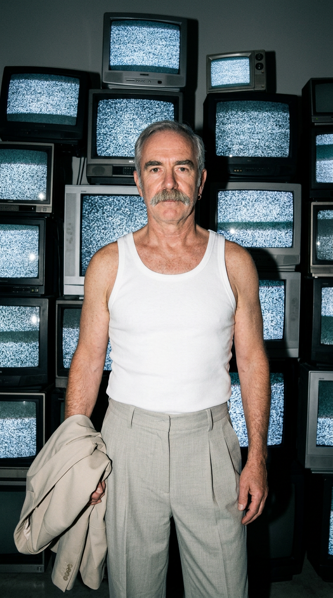
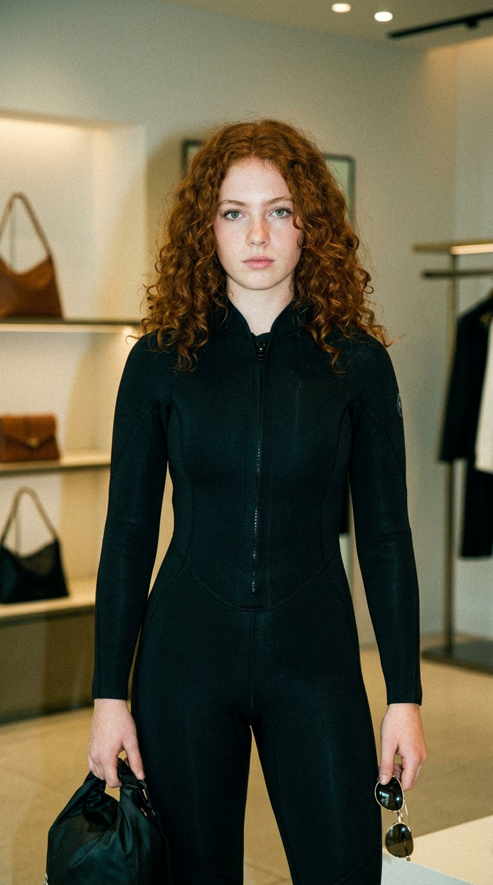

# UGC Content for Feed

Two-stage pipeline for generating UGC-style image content using [fal.ai Nano Banana](https://fal.ai) and GPT-4o.

**Stage 1 — Generate:** Take source photos, describe them with GPT-4o, and re-generate in a casual iPhone-snapshot UGC aesthetic via Nano Banana. Optionally pulls style cues (clothing, makeup, lighting) from a Higgsfield gallery.

**Stage 2 — Remix:** Take generated images and produce creative one-axis remixes — swap the outfit, item, background, or add something to the scene. GPT-4o writes the remix instructions, Nano Banana renders them.

## Setup

```bash
pip install openai fal-client python-dotenv
```

Create a `.env` file:

```
OPENAI_API_KEY=sk-...
FAL_KEY=...
```

## Usage

### Generate UGC images

```bash
python generate.py --ugc-feed --input-dir ./for_feed_preview -N 10 --workers 4 --aspect-ratio 9:16
```

With gallery style inspiration:

```bash
python generate.py --ugc-feed --input-dir ./for_feed_preview -N 2 --workers 2 --gallery-dir higgsfield_gallery
```

Output goes to `ugc_output/` — one `.png` per source image.

### Remix images

```bash
python remix.py --input ./ugc_output --gallery ./higgsfield_gallery -N 5 --aspect-ratio 9:16 --workers 2
```

Output goes to `output_remixes/<image_id>/` with:
- `original.png` — copy of the source
- `remix_1.png`, `remix_2.png` — generated variations
- `metadata.json` — prompts, instructions, and generation details

## Examples

### Generate (Stage 1)

Source photos are re-generated with UGC iPhone-snapshot aesthetic:

<p align="center">
  
  
  
</p>

### Remix (Stage 2)

Each remix changes ONE axis — clothing, held item, background object, or location. The result looks like a sibling photo from the same shoot with a strange/unexpected swap.

**Example 1** — Paris street scene. Original → wetsuit swap → wildflower bouquet swap:

<p align="center">
  
  
  
</p>

**Example 2** — Boutique scene. Original → CRT TV wall background → wetsuit swap:

<p align="center">
  
  
  
</p>

## Project Structure

```
├── generate.py              # Stage 1: describe + regenerate as UGC
├── remix.py                 # Stage 2: one-axis creative remixes
├── remix_guide.md           # Creative guide for remix generation
├── lib/
│   ├── image_gen.py         # fal.ai Nano Banana wrapper
│   ├── nanobanana_ugc_prompt.py  # Prompt templates & builders
│   └── utils.py             # Download, logging helpers
├── utils/
│   ├── parse_higgsfield.py  # Scrape Higgsfield gallery images
│   └── remove_lowres.py     # Filter out low-resolution images
├── for_feed_preview/        # Input source images
├── higgsfield_gallery/      # Gallery images for style inspiration
├── ugc_output/              # Stage 1 output
└── output_remixes/          # Stage 2 output
```
